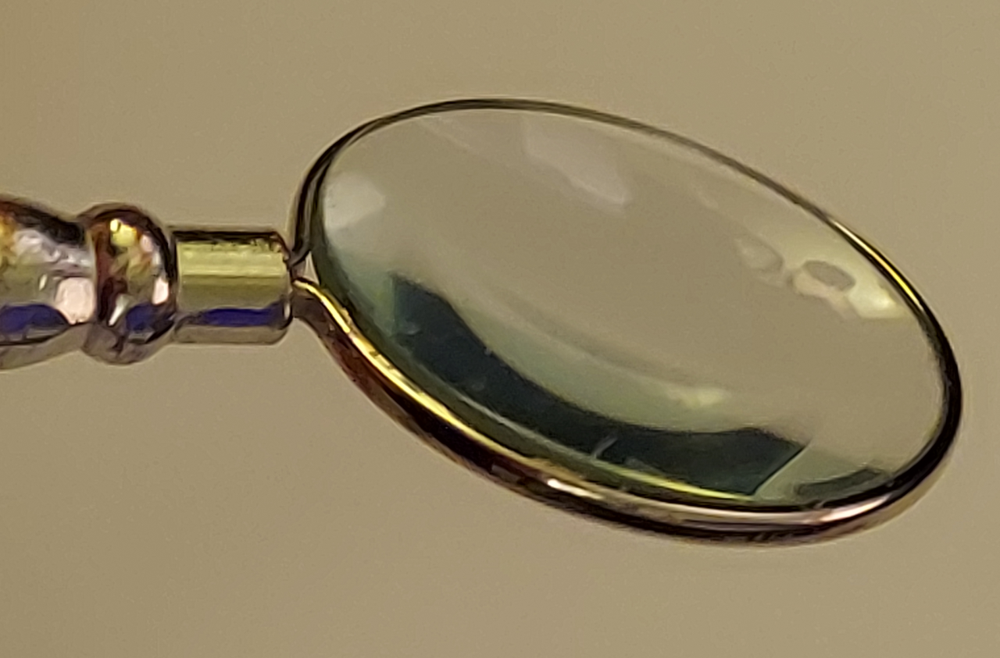

{ width=640px,height:422px }

# Clarity

Clarity is a web development framework written in C++ using Emscripten to compile the code to WebAssembly (wasm). Its purpose is similar to the React or Vue JavaScript frameworks but with the idea that GUI logic will be written as much as possible in C++. It allows you to connect aspects of a data model to web controls in a "reactive" fashion. This means that if the model changes, the web presentation reflects those changes and if the user alters the state of the web controls, the corresponding model elements will update. This is all meant to occur automatically, without the need to explicitly handle web events. The name "Clarity" is meant to imply that you can see your underlying C++ data structures clearly and in an up-to-the-minute fashion without needing to constantly press buttons to reload what you've been working on.

I also had existing C++ code in mind as I wrote this. I wanted something that would allow you to put an existing C++ program (say a large finite element simulation) on a website with as little modification to the existing data structures as possible.

## Getting Started ##

The best place to start is the existing example programs. Doing `make showcase` should build the main example program which contains working examples of the types of nodes implemented so far. The actual "meat" of the showcase app, however, is in `Showcase.hpp` which is instantiated by `showcase.cpp`.

There is also `speedtest.cpp` which basically just creates and destroys a large number of nodes. This is both to monitor performance and also to test the system's ability to avoid memory leaks and segfaults (well, memory overruns since Emscripten doesn't really have segfaults). The basic rule is that any CPP file that starts with a lowercase letter is a runnable program. Files that start with an uppercase letter contain class definitions or implementations.

I've been pretty good about documenting as I go and there are a lot of Doxygen docstrings. If you do `make docs` you'll get a detailed reference on the API and some auto-generated class diagrams.

## Design ##

Setting up responsive web components that allow an end user to interact smoothly with a data model while presenting the api user with an easy to use programming toolkit is a hugely complex task. Taking into account the fact that C++ is a strongly typed language multiplies the potential number of controls still further. The interactions with JavaScript's different and much weaker type system adds another dimension of complexity. 

The current system is the result of several complete refactorings over the Summer of 2022 that I undertook as I realized the shortcomings of each successive approach. The current system basically uses several approaches rather than a single programming paradigm. We do not try to extract all the needed functionality from either an object hierarchy or a system of template functions. Thus, there are OO elements such as the fact that I implement some of the more complex controls (like the CanvasGrid) as child classes of more generalized ones. However, I also use templates extensively to allow C++ types to be used directly in web controls. Finally, there is a large templated factory class that can keep track of many of the parameters that go into making web UI elements.

### The Object Hierarchy ###

**`ClarityNode`**: Base class for all nodes. Implements most of the system's basic behavior. Does *not* contain a model pointer, and cannot be instantiated due to its pure virtual methods.

**`HybridNode<V>`**: The first child class of ClarityNode. The template parameter determines the type of the model pointer. Most nodes are implemented as a HybridNode with the `tag_` member telling us what kind of HTML element to create for it. The "hybrid" part of the name refers to the fact that the earliest versions of Clarity had a special type of node that just held the C++ model data but had no associated DOM element while all others dealt exclusively with the JavaScript DOM side of things. Today, all nodes can both store C++ data *and* interact with the DOM, hence they are hybrids of those earlier types.

**`CanvasElement<V>`**: Descends from `HybridNode<V>`. Not currently used in the examples and meant more as a generic base class for `<canvas>` nodes that might implement games or other types graphical elements.

**`CanvasGrid<V>`**: Descends from `CanvasElement<V>`. Uses an HTML5 `<canvas>` element to display a user-modifiable grid of pixels. I actually created this child class specifically for an app I'm planning to port from my old website and also to flesh out the particulars of implementing complex child classes that handle extended model data, in this case a large array representing the pixel values.

**`Select<V>`**: Descends from `HybridNode<V>`. Selectable dropdown option lists. I think I'm going to make several variants of this since a simple select box doesn't need that same complexity as a multi-select with optgroup tags.

**`Checkbox<V>`**: Descends from `HybridNode<V>`. Your basic checkable box. My example implementation uses V = bool but other types could work too.

---

### Terminology ###

**Node**
: a single GUI element generally created using a node factory. Nodes contains a C++ pointer whose type is determined by the template parameter. Note that the pointer can be null but its type will be used to determine how data is handled in that node.

**Node Factory**
: Due to the large number of factors that come into play in creating nodes, we set up factory objects (using the CLNodeFactory class) that store certain persistent parameters relevant to setting up nodes. The most important of these parameters are the template parameters that determine the C++ data types of the underlying data.

**Peer**
: Nodes can have relationships with other nodes that result in automatic data movement and updating when one node is changed. This can be either due to the end user or the model changing something. A node that has such a relationship with another is called a peer.

**Data Link**
: These are the 'edges' mathematically in our graph. They can not only move but transform data in the process.

**Model**
: The underlying C++ data. Nodes contain pointers to model values. Even when the model pointer is null its type is used to determine what kind of data a given node is expected to store.

### An Interface is a Graph ###

Nodes can be connected together using data links and updating one node can trigger others to update through these links. We can thus regard any Clarity app mathematically as a graph. I've attempted to take into account the differences between cyclic and acyclic graphs in the various update methods but this is limited right now to marking nodes with a boolean "clean/dirty" flag so that data will not bounce between nodes and create infinite loops. A future direction here would be to have page validation methods that would produce warnings or errors due to the presence of graph cycles or conflicting update rules.

### Events ###

When you create a node the system will install a set of event listeners that are designed to implement the movement of data from the model to and from the GUI. We also need a way for api users to add their own event listeners. Preferably, this mechanism would be agnostic as to whether a listener is written in C++ or JS. It should also be possible to set it up so that such a listener is automatically attached to all nodes of a given type or just a particular one or group.

### Todo ###

1. Event API. We still need a framework to offer people a way to easily use events. Need to be able to use C++ or JS for event handling. 
   
2. Selectables could use a common base class.
   
   1. Radio buttons
   
   2. Checkboxes: We have a Checkbox class in Selectables now.
   
   3. Select boxes: Need to make a SimpleSelect class that uses a static option set and uses an underlying type representing the "value" component of `<option value="3" label="Toyota"></option>`. Initially this will be a single value. Multiselections can be vectors of those values. So picking Toyota *and* Ford in my Showcase.cpp test app would mean a vector or list like [1,2]. A simple API can be used to modify the options if need be.

### Todo (cleanups and "doing things right" fixes - somewhat lower priority) ###

1. Go through and replace my improvised val(NULL) constructs with the (presumably more correct/efficient) val::nul()).

### Todo (Lowest priority but probably more fun) ###

1. Go through attributes list at w3schools and just look for fun stuff to add to the project.

### Future Directions ###

#### Templates? ####

There is of course the possibility of developing something akin to React's JSX pages for Clarity but the problem with creating a novel template language is that editors will not initially support it. Losing autocompletion or automatic syntax checking is a pretty high price to pay just to have your C++ code and HTML/CSS all together in one place. Maybe if the library gets enough mindshare that people are willing to write VSCode or Emacs extensions for it...

---
### Programming Notes ###

#### Data Flow Class Methods ####
_These are the current methods that move data around in the system. They went through several reworkings as I refactored the system. I'm documenting them here mostly for my own benefit so that I can think about a better nomenclature and simpler structure for them._

`HybridNode<V>::refreshDOMValueFromModel()`: Called by refresh() at beginning of GUI construction. Main purpose is to initialize the DOM value with the model val. Calls..

`virtual void HybridNode<V>::setDOMVal(const val &inval)`: Calls `ClarityNode::setDOMVal` but also dispatches value to peers.

`virtual void ClarityNode::setDOMVal(const val &inval)`: Only affects the DOM value.

`void HybridNode<V>::setCppValFromJSVal(const val &jsval)`: Writes the provided val object into the cppVal_ according to the template type using the emscripten as() method. At the end it calls pushValToPeers().

`virtual void HybridNode<V>::updateNodeFromDom()`: The main driver of the data flow. When the user uses a control, the method `static INLINE void ClarityNode::updateNodeFromDomById(int id)` gets called and starts the update process moving data "down" from the DOM into the modelVal and possible also "sideways" to the node's peers (if any).

#### Important Constants and Definitions ####

`ClarityInstallURL`: global JS value that tells the system where to look for resources. In the examples I set this inside a `<script>` tag in the HTML template file.
